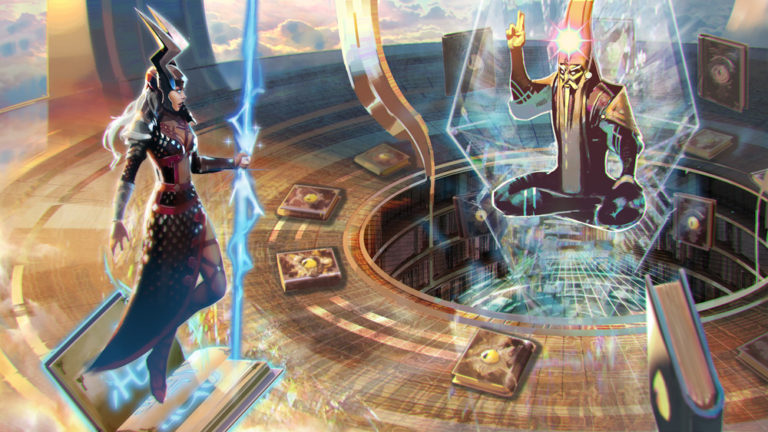
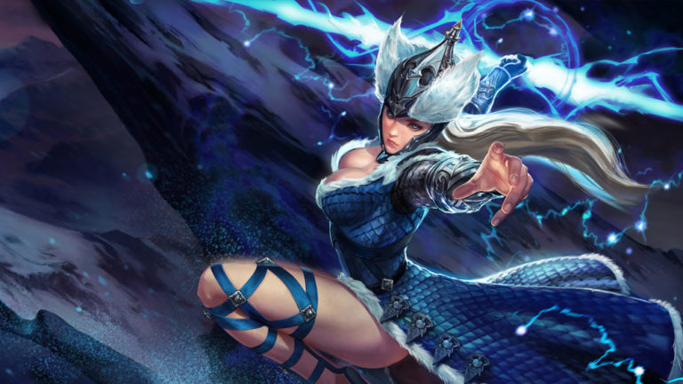

# Varya Lore

## 'THE QUEEN'S GAMBIT'

High above the last of the air, a Churn-infected raven circled the Anvil, the floating land that kept safe the world’s enormous living library. The raven’s crazed eyes glowed and its oversized, razor-sharp talons curled as it tucked back its wings and dove straight down through the library’s single skylight. The glass shattered and tore into the flesh of the diseased bird; its blood steamed where it splashed on the cold hard floor.

All around the library, the single eyes on the covers of the living tomes rolled to stare at the raven as it spiraled around the giant clear crystal at the library’s center. The ancient man entombed within the crystal, King of the Anvil, He of the Two Faces, the Worldseer, did not stir, but one book rose from its designated place and fluttered open to the first blank page. In extravagant script, the words of the Worldseer appeared on the page:

_“When the Well of Power within the belly of Mont Lille swelled again to life, the Eventides raised up a Storm Queen in defense of the Calm. Against the rising Churn the queen raised a formidable army and demanded absolute allegiance of her people.”_

The insane raven bashed into the crystal again and again, screaming into the two faces of the Worldseer, that which watched the past and that which watched the future. The crystal glowed green wherever the raven touched, then cleared again.

Unblinking, the Worldseer continued to write: _“When her need became dire, the queen demanded aid, not only from those of the living world, but also of the Netherworld and the Anvil, where the Churn could not reach. To ensure their cooperation, she sent two infected ravens below and above to deliver a message.”_

With a cough of green smog, the raven let out the last of its held breath in an otherworldly scream:

“As below, so above! As below, so above!”

_“In response,”_ continued the writing, _“the Worldseer, King of the Anvil, called forth Varya, the living knowledge of lightning, to defend the Eventide Empire from the Churn, for the queen’s gambit could not be ignored…”_

The book floated toward the raven, its eye glaring into the monstrous gaze of the raven as its pages fluttered, tore, and folded in on themselves. While the raven watched, the book bent and creased into the form of Varya, the living word made flesh.

Varya opened her hand, and the sky all around the Anvil rumbled. The small hairs on the back of her neck rose as electricity filled the library, collecting into a bolt of lightning that struck into her grip like a spear. With a singular flash, she pierced the lightning through the raven’s heart. Stiff, electrified, the dead bird dropped into her opposite hand.

She looked, then, to the forward-gazing face of the Worldseer, but he wrote no more words upon her heart.

Out of the living library Varya walked, out to the crystal edge of the Anvil. She dropped the Churn-infected dead thing off the side, down onto the living world, the great wheel of life and death, love and war, Churn and Calm. Above her, electricity collected in the clouds, building, humming.

_To war I return._ She smiled as the storm gathered, surrounded her, then delivered her in a flash to the surface of the world.

## 'THUNDERSNOW'

The Secret City was silent, muted by falling snow. Varya walked down an empty road between looming barracks, watchtowers, and tall, wide chimneys from which billowed thick smoke. The war between the two mage princes of the Sleeping Land had played out for fifty years, had spanned thousands of bitter cold miles, had eradicated dozens of nomadic tribes. In the Book of Futures, the Worldseer had seen the victory of Prince Aleksandr, but not for another fifty bloody years.

Today, the future would be rewritten.

Varya paused, the icy breeze playing at the fur lining her robes and helm. Snow and ice steamed and melted around her bare legs and sandaled feet. She stomped one foot and the ground below gave a metal clang.

With the rusty creak of hinges, a door in the street swung open and a mop of curly hair popped out.

“Are you the foreman?” Varya asked in the dwarven language.

“Fore-_woman_,” growled the dwarf in the trap door.

“Very well,” said Varya. “The Storm Queen calls your people to war in Mont Lille.”

The dwarf shook her head free of snow and glared up at Varya. “We’re fine with _this_ war, thanks.”

With one quick yank, Varya pulled the dwarf out of the hole, yowling, by her hair. “The Storm Queen is impressed by your innovations, in particular the tower defenses,” she said, placing the forewoman on her feet.

The forewoman pinched the bridge of her nose, looking down at the dwarves who had collected below. The hammering and steam-whistling echoes of the steel and chrome secret city below the Secret City had gone silent. “Yeah? What’s in it for us?”

Behind Varya, soldiers filed out of the barracks with rifles. From rolling garages came grumbling snow beasts.

“You will outfit the queen’s Citadel and harness the energy of the Well of Power within the mountain. You will have gold, and crystal, and prestige, and if you are successful in defending the Eventides, you will have the rarest payment of all: the thanks of a queen.”

The army made a half-circle behind them. A rifle cocked. A snow beast bellowed with hunger and shook its curled tusks.

A strange sound came from the forewoman’s nose. Only after several moments did Varya realize that she was laughing.

“The thanks! The thanks of a queen!” the dwarf cried, and the ugly nose-sounds grew hysterical. From down below came more of the strange dwarven laughter. “Dwarves have been collecting the thanks of queens and kings since the beginning of our days. With a barrel of royal thanks and a quarter, you could buy a wish from a fountain.”

A rumble sounded in the sky, a faraway thundering; the clouds tumbled over themselves, forming into a dense darkness overhead. Varya held out one hand and smiled. A blue light glowed through her eyes.

The laughter stopped.

With a deafening series of sky-splitting cracks, lightning struck the army, bolt after bolt hammering down from the clouds. Soldiers and beasts alike went stiff and fell dead on their faces in the burnt mud left behind.

The forewoman peered up at Varya, whose mouth formed words unhearable over the loud ringing in her ears. She sighed and looked down the ladder at the other dwarves.

“Alright, pack it up,” she yelled. “We’re going with this lady.”

